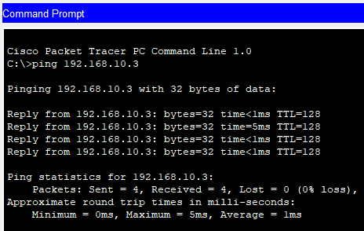

# SOHO Network  Simulation


## 📖 Project Overview
This project implements a fully segmented **Small Office/Home Office (SOHO)** network using Cisco Packet Tracer. The design includes **three VLANs**, **Router-On-A-Stick (ROAS)** for inter-VLAN routing, and centralized **DHCP services** provisioned through the router. The repository includes complete documentation and topology diagrams suitable for training and demonstration.

**Key Objectives:**

* Reduce broadcast congestion through VLAN segmentation.
* Demonstrate proficiency in Layer 2 switching and Layer 3 routing concepts.

## 🏗️ Network Topology


### Design Specifications
The network is divided into three distinct VLANs to enforce logical separation:

| VLAN ID | Name | Subnet |
| :--- | :--- | :--- |
| **10** | HR Department | `192.168.10.0/24` |  
| **20** | Sales Department | `192.168.20.0/24` | 
| **30** | IT Department | `192.168.30.0/24` | 

## 🛠️ Technologies & Protocols Used
* **Core Networking:** IPv4 Addressing, Subnetting, Default Routing
* **Switching (Layer 2):** VLANs (Virtual LANs)
    * 802.1Q Trunking (Tagging)
    * Access Ports vs. Trunk Ports
* **Routing (Layer 3):** Router-on-a-Stick (Subinterfaces)
    * SVIs (Switched Virtual Interfaces for L3 Switch version)
    * Static Routing
* **Services:** DHCP (Dynamic Host Configuration Protocol) with excluded addresses (Default gateway address in each VLAN)

## ⚙️ Configuration Highlights
Below are snippets of the core configurations applied to the devices.

## Router-on-a-Stick (Inter-VLAN Routing) for Layer 2 Switch

**Network & End Devices**: PCs and 2 Cisco 2960 switches, a Cisco 1941 router

**1. Connect each device to match the topology. (use Copper Straight-Through)**

*(Optional) Rename each device to match its purpose.


**2. Create VLANs on both switches. (global config)**
```cisco
SW1(config)# vlan 10
SW1(config-vlan)# name HR

SW1(config-if)# vlan 20 
SW1(config-vlan)# name Sales

SW1(config)# vlan 30
SW1(config-vlan)# name IT
```


**3. Configure VLANs on both switches to match the topology.**

Ex. On SW1
```cisco
SW1(config)# interface range FastEthernet0/1-3
SW1(config-if-range)# switchport mode access
SW1(config-if-range)# switchport access vlan 10

SW1(config)# interface range FastEthernet0/4-5
SW1(config-if-range)# switchport mode access
SW1(config-if-range)# switchport access vlan 20
```
*Tip: You can also use contractions, switches and routers will complete the command. Also, if you did not create VLAN before configuring them, it will be created on the spot!*

```cisco
SW1(config)# int ra f0/1-3
Sw1(config-if-range)# sw mode ac
Sw1(config-if-range)# sw ac vlan 10 

SW1(config)# int ra f0/4-5
Sw1(config-if-range)# sw mode ac
SW1(config-if-range)# sw ac vlan 20
```

*Use 'show vlan brief' ('do show' - interface config mode)*


**4. Configure IPs on PCs to match their subnets (Static Configuration) and use 'ping' in command prompt another host on the same VLAN to test connectivity.**

*Note: 192.168.xx.1 will be reserve for default gateway IPs*



**5. Configure trunk port on both switch and on the SW2, set the interface connecting to the router to be a trunk port.**
```cisco
SW2(config)# interface FastEthernet0/24
SW1(config-if)# switchport mode trunk

SW2(config)# interface GigabitEthernet0/1
SW2(config-if)# swtichport mode trunk
```
*Use 'show interfaces trunk' ('do show' - interface config mode) and ping vlan20 on another switch to test connectivity*


**6. Configure subinterfaces on the Gateway Router to allow communication between isolated VLANs.**

```cisco
no shutdown 
!
R1(config)# interface GigabitEthernet0/0.10
R1(config-if)# description Gateway for HR VLAN
R1(config-if)# encapsulation dot1Q 10
R1(config-if)# ip address 192.168.10.1 255.255.255.0
!
R1(config)# interface GigabitEthernet0/0.20
R1(config-if)# description Gateway for Sales VLAN
R1(config-if)# encapsulation dot1Q 20
R1(config-if)# ip address 192.168.20.1 255.255.255.0
!
R1(config)# interface GigabitEthernet0/0.30
R1(config-if)# description Gateway for IT VLAN
R1(config-if)# encapsulation dot1Q 30
R1(config-if)# ip address 192.168.30.1 255.255.255.0
```
**7. Configure the appropiate default gateway on each PC and ping test.**

*Note: ping may be failed for the first time due to ARP*


### **SVIs (Switch Virtual Interfaces) for Layer 3 Switch**

**Network & End Devices**: PCs and 2 Cisco 3560-24ps multilayer switches, a Cisco 1941 router

**1. Repeat the step 1-5 from L2 switch version**


**2. When configuring trunk ports on the switches, if trunk encapsulation is not configured, it will reject the command**
```cisco
SW1(config)# interface FastEthernet0/24
SW1(config-if)# switchport trunk encapsulation dot1q
SW1(config-if)# mode trunk
```


**3. Test connectivity with ping (intra)**

*Use 'show vlan brief' ('do show' - interface config mode)*


**4. Use 'ip routing' to enable layer 3 routing on both switches**

*CRITICAL COMMAND: Without this, the switch won't route packets between VLANs!!!*
```cisco
SW1(config)# ip routing
```

**5. Create the SVIs (Switch Virtual Interfaces) on both**
```cisco
! Create the SVI for VLAN 10 (Layer 3)
SW1(config)# interface vlan 10
SW1(config-if)# description Gateway for HR
SW1(config-if)# ip address 192.168.10.1 255.255.255.0
SW1(config-if)# no shutdown
SW1(config-if)# exit

! Create the SVI for VLAN 20
SW1(config)# interface vlan 20
SW1(config-if)# description Gateway for Sales
SW1(config-if)# ip address 192.168.20.1 255.255.255.0
SW1(config-if)# no shutdown

! Create the SVI for VLAN 30
SW1(config)# interface vlan 30
SW1(config-if)# description Gateway for IT
SW1(config-if)# ip address 192.168.30.1 255.255.255.0
SW1(config-if)# no shutdown
```
*Use 'show interfaces trunk' ('do show' - interface config mode) and ping vlan20 on another switch to test connectivity*


**6. Configure subinterfaces on the Gateway Router to allow communication between isolated VLANs.**

```cisco
no shutdown 
!
interface GigabitEthernet0/0.10
 description Gateway for HR VLAN
 encapsulation dot1Q 10
 ip address 192.168.10.1 255.255.255.0
!
interface GigabitEthernet0/0.20
 description Gateway for Sales VLAN
 encapsulation dot1Q 20
 ip address 192.168.20.1 255.255.255.0
!
interface GigabitEthernet0/0.30
 description Gateway for IT VLAN
 encapsulation dot1Q 30
 ip address 192.168.30.1 255.255.255.0
```
**7. Configure the appropiate default gateway on each PC and ping test.**

*Note: ping may be failed for the first time due to ARP*
