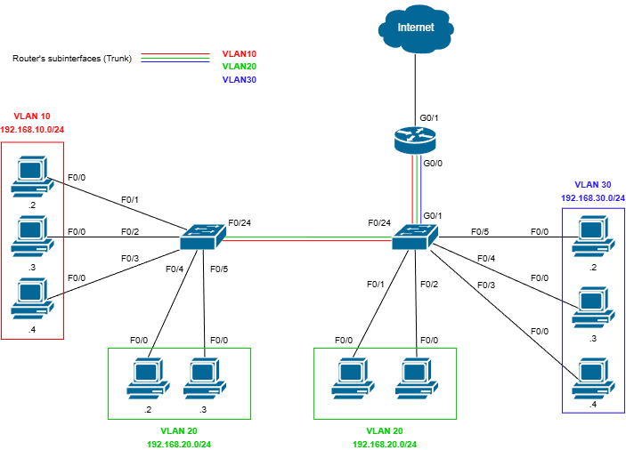
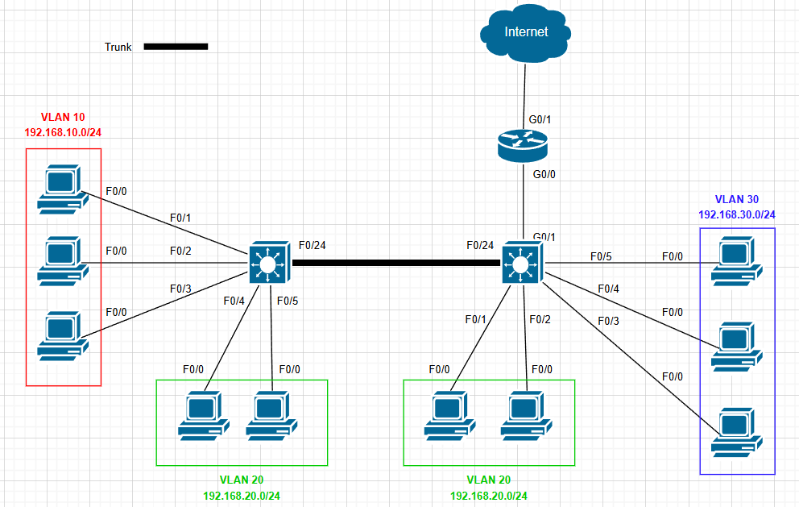
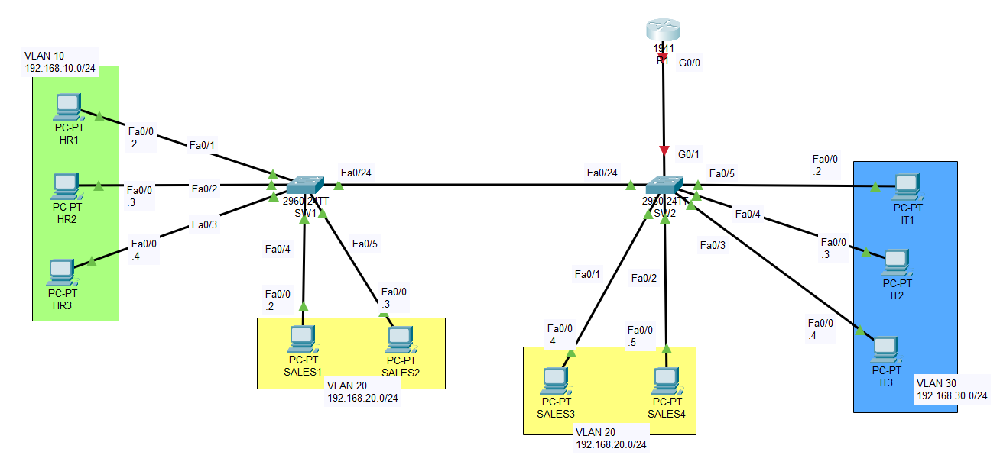
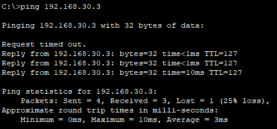
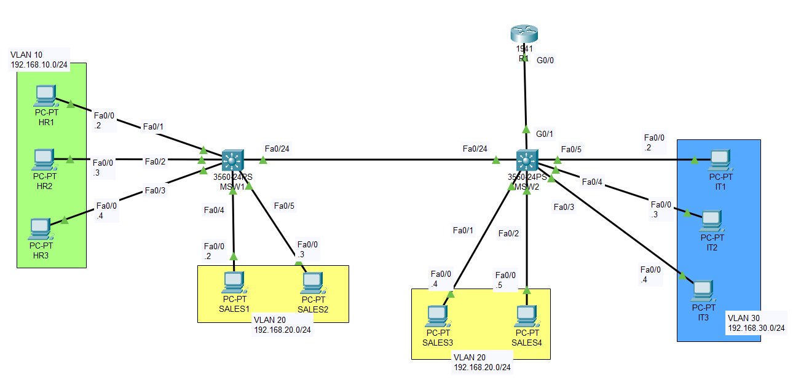
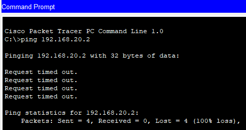
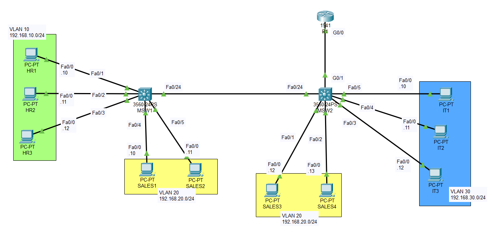
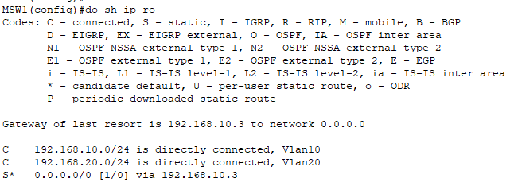
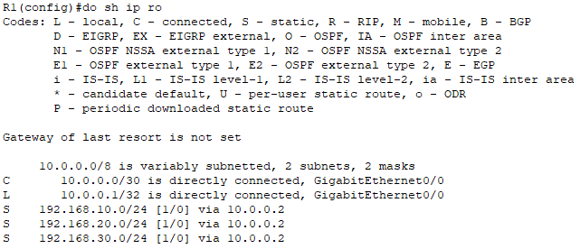
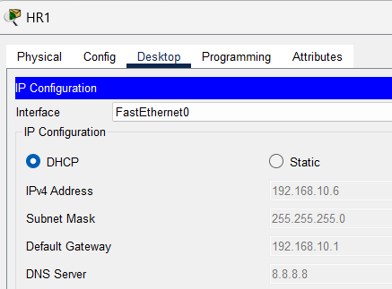

# SOHO Network  Simulation


## 📖 Project Overview
This project implements a segmented SOHO network with **three VLANs**, supporting inter-VLAN routing via **router-on-a-stick (ROAS)** and an alternative Layer 3 design using **SVIs** on a multilayer switch. Centralized **DHCP services** provide per-VLAN address allocation, while **HSRP** is configured to ensure gateway redundancy. Network security is enhanced by disabling unused features (VTP, DTP) and assigning an unused native VLAN. The project includes complete documentation and professional topology diagrams.

**Key Objectives:**

* Reduce broadcast congestion through VLAN segmentation.
* Demonstrate proficiency in Layer 2 switching and Layer 3 routing concepts.
* Implement HSRP and DHCP (with DHCP Relay Agent)

## 🏗️ Network Topology

* ## Router-on-a-Stick (Inter-VLAN Routing) for Layer 2 Switch
 
  

* ## SVIs (Switch Virtual Interfaces) for Layer 3 Switch
 
  

### Design Specifications
The network is divided into three distinct VLANs to enforce logical separation:

| VLAN ID | Name | Subnet |
| :--- | :--- | :--- |
| **10** | HR Department | `192.168.10.0/24` |  
| **20** | Sales Department | `192.168.20.0/24` | 
| **30** | IT Department | `192.168.30.0/24` | 

## 🛠️ Technologies & Protocols Used
* **Core Networking:** IPv4 Addressing, Subnetting, Default Routing
* **Switching (Layer 2):** VLANs (Virtual LANs)
    * 802.1Q Trunking (Tagging)
    * Access Ports vs. Trunk Ports
* **Routing (Layer 3):** Router-on-a-Stick (Subinterfaces)
    * SVIs (Switched Virtual Interfaces for L3 Switch version)
    * Static Routing
* **Services:** DHCP (Dynamic Host Configuration Protocol) with excluded addresses (Default gateway address in each VLAN)

## ⚙️ Configuration Highlights (*L3 version is below the last step of the L2 version)
Below are snippets of the core configurations applied to the devices.

## Router-on-a-Stick (Inter-VLAN Routing) for Layer 2 Switch

**Network & End Devices**: PCs and 2 Cisco 2960 switches, a Cisco 1941 router

**1. Connect each device to match the topology. (use Copper Straight-Through)**

*(Optional) Rename each device to match its purpose.




**2. Create VLANs on both switches. (global config)**
```cisco
SW1(config)# vlan 10
SW1(config-vlan)# name HR

SW1(config-if)# vlan 20 
SW1(config-vlan)# name Sales

SW1(config)# vlan 30
SW1(config-vlan)# name IT
```


**3. Configure VLANs on both switches to match the topology.**

Ex. On SW1
```cisco
SW1(config)# interface range FastEthernet0/1-3
SW1(config-if-range)# switchport mode access
SW1(config-if-range)# switchport access vlan 10

SW1(config)# interface range FastEthernet0/4-5
SW1(config-if-range)# switchport mode access
SW1(config-if-range)# switchport access vlan 20
```
*Tip: You can also use contractions, switches and routers will complete the command. Also, if you did not create VLAN before configuring them, it will be created on the spot!*

```cisco
SW1(config)# int ra f0/1-3
Sw1(config-if-range)# sw mode ac
Sw1(config-if-range)# sw ac vlan 10 

SW1(config)# int ra f0/4-5
Sw1(config-if-range)# sw mode ac
SW1(config-if-range)# sw ac vlan 20
```

*Use 'show vlan brief' ('do show' - interface config mode)*


**4. Configure IPs on PCs to match their subnets (Static Configuration) and use 'ping' in command prompt another host on the same VLAN to test connectivity.**

*Note: 192.168.xx.1 will be reserve for default gateway IPs*


**5. Configure trunk port on both switch and on the SW2, set the interface connecting to the router to be a trunk port.**
```cisco
SW2(config)# interface FastEthernet0/24
SW1(config-if)# switchport mode trunk

SW2(config)# interface GigabitEthernet0/1
SW2(config-if)# swtichport mode trunk
```
*Use 'show interfaces trunk' ('do show' - interface config mode) and ping vlan20 on another switch to test connectivity*


**6. Configure subinterfaces on the Gateway Router to allow communication between isolated VLANs.**

```cisco
no shutdown 
!
R1(config)# interface GigabitEthernet0/0.10
R1(config-if)# description Gateway for HR VLAN
R1(config-if)# encapsulation dot1Q 10
R1(config-if)# ip address 192.168.10.1 255.255.255.0
!
R1(config)# interface GigabitEthernet0/0.20
R1(config-if)# description Gateway for Sales VLAN
R1(config-if)# encapsulation dot1Q 20
R1(config-if)# ip address 192.168.20.1 255.255.255.0
!
R1(config)# interface GigabitEthernet0/0.30
R1(config-if)# description Gateway for IT VLAN
R1(config-if)# encapsulation dot1Q 30
R1(config-if)# ip address 192.168.30.1 255.255.255.0
```
**7. Configure the appropiate default gateway on each PC and ping test.**

*Note: ping may be failed for the first time due to ARP*


### **SVIs (Switch Virtual Interfaces) for Layer 3 Switch**

**Network & End Devices**: PCs and 2 Cisco 3560-24ps multilayer switches, a Cisco 1941 router

**1. Repeat the step 1-5 from L2 switch version**



**2. When configuring trunk ports on the switches, if trunk encapsulation is not configured, it will reject the command**
```cisco
MSW1(config)# interface FastEthernet0/24
MSW1(config-if)# switchport trunk encapsulation dot1q
MSW1(config-if)# mode trunk
```


**3. Test connectivity with ping (intra)**

*Use 'show vlan brief' ('do show' - interface config mode)*


**4. Use 'ip routing' to enable layer 3 routing on both switches**

**CRITICAL COMMAND: Without this, the switch won't route packets between VLANs!!!**
```cisco
MSW1(config)# ip routing
```

**5. Create the SVIs (Switch Virtual Interfaces) on both switches**
```cisco
! Create the SVI for VLAN 10 (Layer 3)
MSW1(config)# interface vlan 10
MSW1(config-if)# description Gateway for HR
MSW1(config-if)# ip address 192.168.10.1 255.255.255.0
MSW1(config-if)# no shutdown
MSW1(config-if)# exit

! Create the SVI for VLAN 20
MSW1(config)# interface vlan 20
MSW1(config-if)# description Gateway for Sales
MSW1(config-if)# ip address 192.168.20.1 255.255.255.0
MSW1(config-if)# no shutdown

! Create the SVI for VLAN 30
MSW1(config)# interface vlan 30
MSW1(config-if)# description Gateway for IT
MSW1(config-if)# ip address 192.168.30.1 255.255.255.0
MSW1(config-if)# no shutdown
```
*Use 'show ip int b' ('do show' - interface config mode) and ping host on VLAN 20 with PC in VLAN 10



**Why packets were lost????**

Configuring identical IP addresses for SVIs on both switches causes conflicts. While the simplest fix is to **delete one SVI**, the better solution is to implement **HSRP (Hot Standby Router Protocol).** This method resolves the conflict while simultaneously increasing redundancy.


**6. Change IPs on PCs to avoid conflicts and on MSW1 (No Router) - The BACKUP:**



```cisco
MSW1(config)# interface vlan 10
MSW1(config-if)# ip address 192.168.10.2 255.255.255.0  
MSW1(config-if)# standby 1 ip 192.168.10.1 
Switch_1(config-if)# standby 1 priority 100  <-- Default priority

MSW1(config)# interface vlan 20
MSW1(config-if)# ip address 192.168.20.2 255.255.255.0 
MSW1(config-if)# standby 1 ip 192.168.20.1 

MSW1(config)# interface vlan 30
MSW1(config-if)# ip address 192.168.30.2 255.255.255.0 
MSW1(config-if)# standby 1 ip 192.168.30.1 
```

**7. On MSW2 (Connected to Router) - The ACTIVE: and ping to check**
```cisco
MSW2(config)# interface vlan 10
MSW2(config-if)# ip address 192.168.10.3 255.255.255.0  
MSW2(config-if)# standby 1 ip 192.168.10.1 
MSW2(config-if)# standby 1 priority 110  <-- HIGHER priority makes it Active
MSW2(config-if)# standby 1 preempt

MSW2(config)# interface vlan 20
MSW2(config-if)# ip address 192.168.20.3 255.255.255.0  
MSW2(config-if)# standby 1 ip 192.168.20.1 
MSW2(config-if)# standby 1 priority 110  <-- HIGHER priority makes it Active
MSW2(config-if)# standby 1 preempt

MSW2(config)# interface vlan 30
MSW2(config-if)# ip address 192.168.30.3 255.255.255.0  
MSW2(config-if)# standby 1 ip 192.168.30.1 
MSW2(config-if)# standby 1 priority 110  <-- HIGHER priority makes it Active
MSW2(config-if)# standby 1 preempt
```


**8. On MSW2, Configure the Uplink to the Router (Routed Port)**
```cisco
MSW2(config)# interface GigabitEthernet0/1
MSW2(config-if)# no switchport       <-- Turns the port from L2 to L3
MSW2(config-if)# ip address 10.0.0.2 255.255.255.252
MSW2(config-if)# no shutdown
```


**9. On R1, Delete subinterfaces and configure the IP**
```cisco
R1(config)# interface GigabitEthernet0/0 
R1(config-if)# no interface GigabitEthernet0/0.10
R1(config-if)# no interface GigabitEthernet0/0.20
R1(config-if)# no interface GigabitEthernet0/0.30

R1(config)# interface GigabitEthernet0/0
R1(config-if)# ip address 10.0.0.1 255.255.255.252
R1(config-if)# no shutdown
```


**10. Configure default route on MSW1 and MSW2**
```cisco
!MSW1 - Send all internet traffic to Switch 2's physical IP
MSW1(config)# ip route 0.0.0.0 0.0.0.0 192.168.10.3

!MSW2 - Send all internet traffic to the Router's IP"
MSW2(config)# ip route 0.0.0.0 0.0.0.0 10.0.0.1
```



**11. Configure routes on R1 to each subnet**
```cisco
R1(config)# ip route 192.168.10.0 255.255.255.0 10.0.0.2
R1(config)# ip route 192.168.20.0 255.255.255.0 10.0.0.2
R1(config)# ip route 192.168.30.0 255.255.255.0 10.0.0.2
```




**12. Now DHCP, exclude SW1 and MSW2 IPs from DHCP**
```cisco
R1(config)# ip dhcp excluded-address 192.168.10.1 192.168.10.3
R1(config)# ip dhcp excluded-address 192.168.20.1 192.168.20.3
R1(config)# ip dhcp excluded-address 192.168.30.1 192.168.30.3
```

**12. Create pools for each department**
```cisco
R1(config)# ip dhcp pool HR
R1(dhcp-config)# network 192.168.10.0 255.255.255.0
R1(dhcp-config)# default-router 192.168.10.1  <-- MUST be the Virtual IP
R1(dhcp-config)# dns-server 8.8.8.8

R1(config)# ip dhcp pool Sales
R1(dhcp-config)# network 192.168.20.0 255.255.255.0
R1(dhcp-config)# default-router 192.168.20.1  <-- MUST be the Virtual IP
R1(dhcp-config)# dns-server 8.8.8.8

R1(config)# ip dhcp pool IT
R1(dhcp-config)# network 192.168.30.0 255.255.255.0
R1(dhcp-config)# default-router 192.168.30.1  <-- MUST be the Virtual IP
R1(dhcp-config)# dns-server 8.8.8.8
```


**13. VERY IMPORTANT!!! on MSW2, configure it to be DHCP Relay Agent of R1**

if this step is neglected, R1 **cannot** give IPs to end hosts because DHCP relies on broadcasts and by definition, broadcasts cannot cross a router.

```cisco
MSW2(config)# interface vlan 10
MSW2(config-if)# ip helper-address 10.0.0.1

MSW2(config)# interface vlan 20
MSW2(config-if)# ip helper-address 10.0.0.1

MSW2(config)# interface vlan 30
MSW2(config-if)# ip helper-address 10.0.0.1
```

Now end hosts should be able to get IPs from R1 via DHCP




**BONUS - For security purposes, you can disable unused features (VTP, DTP) and change the native VLAN to be an unused VLAN**

```cisco
!for trunk ports (configuring an interface to be an access port also disable DTP)

MSW1(config-if)# switchport nonegotiate
MSW1(config-if)#switchport trunk native vlan 3333
MSW2(config-if)# switchport nonegotiate
MSW2(config-if)#switchport trunk native vlan 3333

!change VTP mode to transparent and VTP domain name to an unused one (default = 'cisco')
MSW1(config)# vtp mode transparent
MSW1(config-if)# vtp domain msw1

MSW2(config)# interface vlan 30
MSW2(config-if)# vtp domain msw2
```